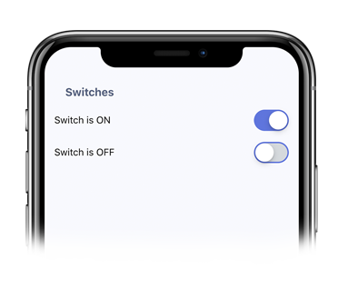

# Switch

This component extends React Native's native Switch component. All props are available.

### Usage
Simple example:
```

toggleSwitch = switchId => this.setState({ [switchId]: !this.state[switchId] });

<Switch
  value={this.state['switch-1']}
  onValueChange={() => this.toggleSwitch('switch-1')}
/>
```
<p align="center">
  
</p>


### Props

|         Prop        | Type | Default | Description |
|:-------------------:|:----:|:-------:|:-----------:|
|        value        | bool |   null  |             |
| [...Switch.propTypes](https://facebook.github.io/react-native/docs/switch#docsNav)                             |

### Switch
This was built using React Native's Switch component on which you can find more about clicking [here](https://facebook.github.io/react-native/docs/switch).